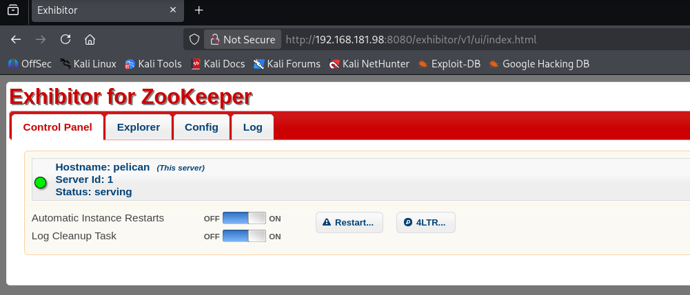
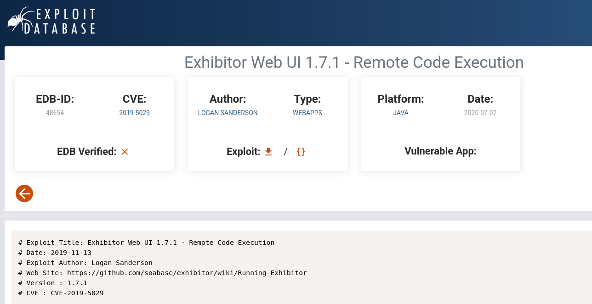
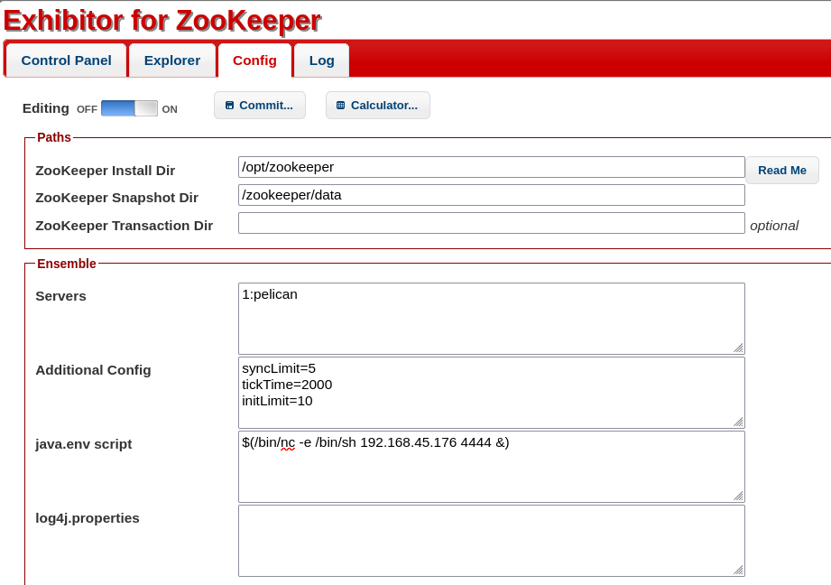
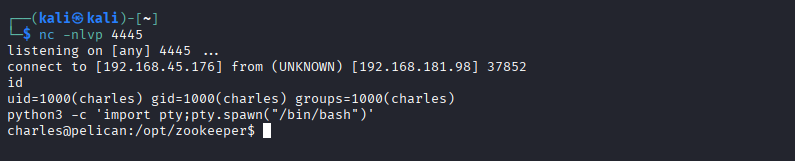
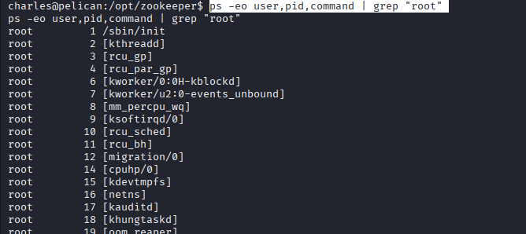
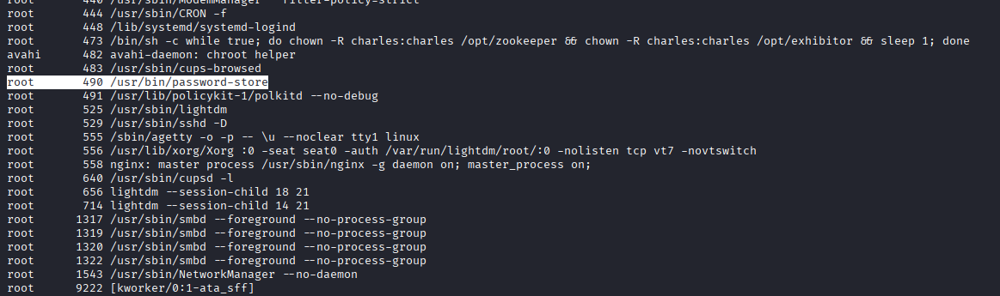
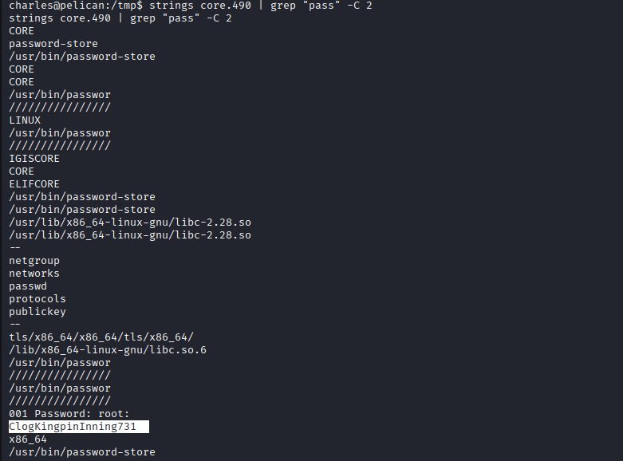
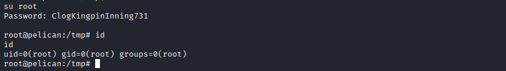

## Pelican - Opis

## Informacje wstępne [toc]

- **Platforma:** OffSec Proving Grounds
- **Maszyna:** Pelican
- **Poziom:** Easy/Medium

Maszyna *Pelican* demonstruje realne błędy konfiguracyjne w usłudze administracyjnej aplikacji Exhibitor w wersji 1.0 podatnej CVE-2019-5029 poprzez ustawienie własnej zmiennej środowiskowej JVM.
Zmiana konfiguracji Exhibitora powodowała restart usługi co umożliwiało wykonanie RCE na maszynie i potencjalne przejęcie systemu jako użytkownik usługi. Pełna kompromitacja hosta nastąpiła przez zbyt szerokie uprawnienia użytkownika w systemie ( sudo na gcore ) co umożliwiło odczytanie danych procesu w tym przechowywanego gołym tekstem hasła roota.

## Enumeracja [toc]

W pierwszym kroku skanujemy otrzymany adres IP celem wylistowania otwartych portów z wykorzystaniem narzędzia nmap.

```
┌──(kali㉿kali)-[~]
└─$ nmap -A 192.168.181.98  
Starting Nmap 7.95 ( https://nmap.org ) at 2025-12-30 09:27 EST
Nmap scan report for 192.168.181.98
Host is up (0.037s latency).
Not shown: 993 closed tcp ports (reset)
PORT     STATE SERVICE     VERSION
22/tcp   open  ssh         OpenSSH 7.9p1 Debian 10+deb10u2 (protocol 2.0)
| ssh-hostkey: 
|   2048 a8:e1:60:68:be:f5:8e:70:70:54:b4:27:ee:9a:7e:7f (RSA)
|   256 bb:99:9a:45:3f:35:0b:b3:49:e6:cf:11:49:87:8d:94 (ECDSA)
|_  256 f2:eb:fc:45:d7:e9:80:77:66:a3:93:53:de:00:57:9c (ED25519)
139/tcp  open  netbios-ssn Samba smbd 3.X - 4.X (workgroup: WORKGROUP)
445/tcp  open  netbios-ssn Samba smbd 4.9.5-Debian (workgroup: WORKGROUP)
631/tcp  open  ipp         CUPS 2.2
| http-methods: 
|_  Potentially risky methods: PUT
|_http-title: Forbidden - CUPS v2.2.10
|_http-server-header: CUPS/2.2 IPP/2.1
2222/tcp open  ssh         OpenSSH 7.9p1 Debian 10+deb10u2 (protocol 2.0)
| ssh-hostkey: 
|   2048 a8:e1:60:68:be:f5:8e:70:70:54:b4:27:ee:9a:7e:7f (RSA)
|   256 bb:99:9a:45:3f:35:0b:b3:49:e6:cf:11:49:87:8d:94 (ECDSA)
|_  256 f2:eb:fc:45:d7:e9:80:77:66:a3:93:53:de:00:57:9c (ED25519)
8080/tcp open  http        Jetty 1.0
|_http-title: Error 404 Not Found
|_http-server-header: Jetty(1.0)
8081/tcp open  http        nginx 1.14.2
|_http-title: Did not follow redirect to http://192.168.181.98:8080/exhibitor/v1/ui/index.html
|_http-server-header: nginx/1.14.2
Device type: general purpose|router
Running: Linux 5.X, MikroTik RouterOS 7.X
OS CPE: cpe:/o:linux:linux_kernel:5 cpe:/o:mikrotik:routeros:7 cpe:/o:linux:linux_kernel:5.6.3
OS details: Linux 5.0 - 5.14, MikroTik RouterOS 7.2 - 7.5 (Linux 5.6.3)
Network Distance: 4 hops
Service Info: Host: PELICAN; OS: Linux; CPE: cpe:/o:linux:linux_kernel

Host script results:
|_clock-skew: mean: 1h40m01s, deviation: 2h53m13s, median: 0s
| smb-os-discovery: 
|   OS: Windows 6.1 (Samba 4.9.5-Debian)
|   Computer name: pelican
|   NetBIOS computer name: PELICAN\x00
|   Domain name: \x00
|   FQDN: pelican
|_  System time: 2025-12-30T09:27:46-05:00
| smb-security-mode: 
|   account_used: guest
|   authentication_level: user
|   challenge_response: supported
|_  message_signing: disabled (dangerous, but default)
| smb2-security-mode: 
|   3:1:1: 
|_    Message signing enabled but not required
| smb2-time: 
|   date: 2025-12-30T14:27:44
|_  start_date: N/A

TRACEROUTE (using port 5900/tcp)
HOP RTT      ADDRESS
1   38.13 ms 192.168.45.1
2   38.14 ms 192.168.45.254
3   38.15 ms 192.168.251.1
4   38.21 ms 192.168.181.98

OS and Service detection performed. Please report any incorrect results at https://nmap.org/submit/ .
Nmap done: 1 IP address (1 host up) scanned in 21.01 seconds

```

| Port    | Usługa | Opis              |
|---------|--------|-------------------|
| 22      | SSH    | OpenSSH 7.9       |
| 139/445 | SMB    | Samba             |
| 631     | CUPS   | Printing service  |
| 8080    | HTTP   | Jetty – Exhibitor |
| 8081    | HTTP   | nginx             |


jak powyżej widać jest otwartych kilka interesujących portów jednak w wyniku skanu można zauważyć interesujący adres url pod portem 8081; 
http://192.168.181.98:8080/exhibitor/v1/ui/index.html



Po jego sprawdzeniu okazuje że istnieje publicznie opisana podatność na tą usługę opisana pod numerem CVE-2019-5029,


[*Źródło:* https://www.exploit-db.com/exploits/48654]


Z opisu podatności wynika, że w przypadku gdy mamy dostępny panel zarządzania bez logowania, można ustawić własne parametry zmiennych środowiskowych javy, a aplikacja wprowadza zastosowane zmiany w tym wykonując dowolny wprowadzony kod. Brzmi jak wzorowe RCE ? TAK :)

## Exploitacja [toc]




Wprowadzono odpowiedni wpis dający reverse shell do zmiennej javy, jednocześnie na hoscie pentestera uruchomiony zostaje nasłuch na tym samym porcie co RCE. Zapisano commit co powoduje restart maszyny;

```
nc -nlvp 44444
```
Po krótkiej chwili przejęto konto uzytkownika ktory uruchamia exhibitora.



Po zapisaniu flagi użytkownika, szukano sposobu na eskalację do roota systemu. 

## Eskalacja Uprawnień

Użytkownik posiadał uprawnienia sudo do wykonania /usr/bin/gcore

```
(ALL) NOPASSWD: /usr/bin/gcore
```
**gcore** jest to narzędzie używane do zrzutów zawartości aktywnego procesu, w przypadku posiadania uprawnień sudo można zrzucać również procesy roota. 

Odczytano aktywne procesy oraz poszukiwano takich które mogą być przydatne do eskalacji.





Jak widać powyżej istnieje proces który wprost sugeruje że może przechowywać hasła
Po wykonaniu zrzutu procesu, odczytano go. Jest to plik binarny więc trzeba odsiać śmieci szukając czytelnych treści,



Uzyskane hasło użyto do eskalacji. ROOT



